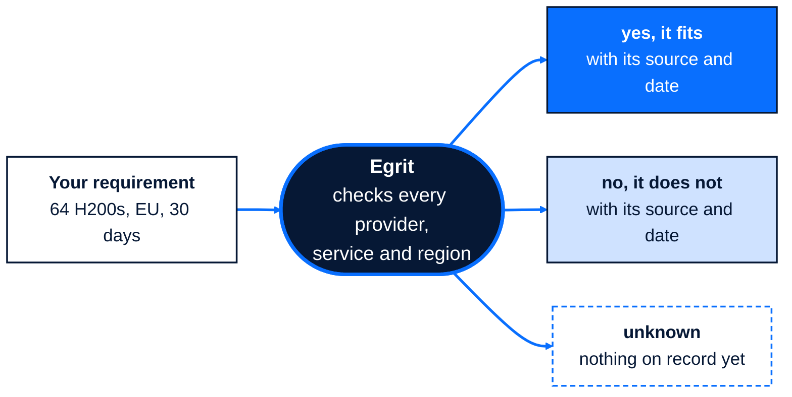

**Find compute you can actually use.**

Egrit helps you find GPU cloud, NeoCloud and managed inference capacity that
fits what you need, and shows the evidence behind every answer.

For each provider and region, Egrit compiles what is on public record, from
the provider's own documentation and from independent sources, and keeps it
current. Every statement carries its source, the date it was read and a grade
that says how far it goes:

- what the provider declares;
- what independent sources establish;
- what nobody can prove yet.

Egrit keeps those apart, and it filters rather than ranks. No provider pays
for a grade.

Egrit never holds your workloads, prompts, data, models, results or
credentials.

## Working in a regulated organisation

In a bank, an insurer, a health service or another regulated organisation,
finding capacity is only half the job: your risk and procurement teams have
to accept a provider before you can use it. Egrit shows where each service
runs and what is on record about it, with the source and date of every
statement, so you can see early which options are worth taking to them, and
give them the reasons.

Egrit does not decide whether a provider suits your organisation. Your own
teams do.

## Status

Early development. Search is not open yet. To hear when it is, get early
access at [www.egrit.ai](https://www.egrit.ai).

Public repositories will appear here when they are ready.

## About

Egrit is a product of Neul Space Ltd, registered in England and Wales.
